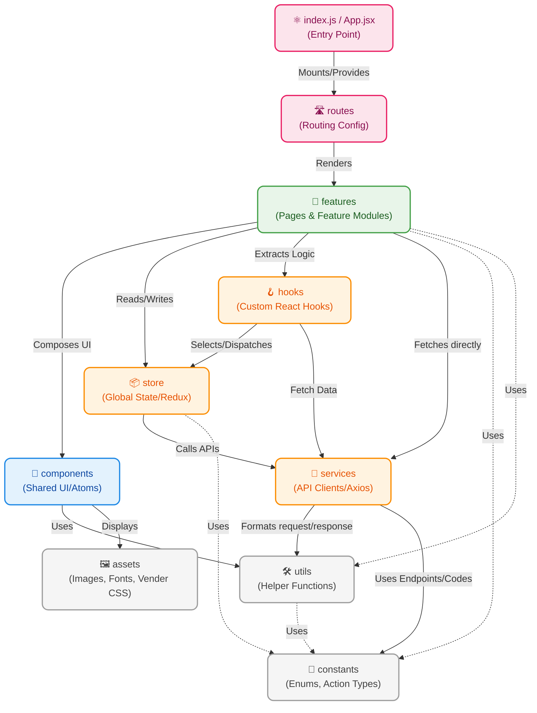

# Hệ Thống Sơ Đồ Package Frontend (ReactJS)

Dưới đây là sơ đồ Package (Kiến trúc các thư mục) của dự án Frontend `SEP490_G84_FE`.
Kiến trúc này áp dụng mô hình Feature-Based / Component-Based tiêu chuẩn của React để quản lý và mở rộng code dễ dàng.

## 1. Biểu đồ kiến trúc gói Frontend (Package Dependencies Diagram)

Sử dụng Flowchart để trực quan hóa cách luồng dữ liệu và giao diện được lắp ráp từ các thành phần thư mục:

## 2. Giải thích vai trò các Package Frontend

Trong mô hình React hiện đại, mã nguồn được module hoá để giảm thiểu coupling (sự phụ thuộc chặt chẽ) giữa các logic khác nhau. Vai trò của từng thư mục như sau:

| Package (Thư mục) | Vai trò (Role) | Chức năng (Responsibilities) |
| :--- | :--- | :--- |
| **`routes`** | Định tuyến (Routing) | Cấu hình cây định tuyến (React Router), phân luồng Controller URL maps với các Views tương ứng từ thư mục `features`. Bảo vệ các Route quyền Admin hoặc yêu cầu đăng nhập. |
| **`features`** | Tính năng độc lập (Pages/Modules) | Đây là nơi chứa các trang (Home, Admin Dashboard, Booking Page...). Mỗi feature tự quản lý state biểu diễn nhỏ của nó, lắp ghép các `components` và kết nối với `store` hoặc `services`. |
| **`components`** | Giao diện dùng chung (UI Elements) | Các thành phần UI có thể tái sử dụng (Button, Modal, Table, Header...). Không chứa/hạn chế chứa business logic hay gọi API trực tiếp. Đây là dạng "Dumb/Presentational Components". |
| **`store`** | Trạng thái toàn cục (Global State) | Quản lý dữ liệu dùng chung (ví dụ: Session User, Giỏ phòng, Notification...). Nơi xử lý logic Redux (slices, actions, reducers) hoặc Context/Zustand. |
| **`hooks`** | Tái sử dụng logic (React Hooks) | Chứa các Custom Hooks đóng gói chuỗi các React hooks nguyên thủy (`useState`, `useEffect`). Dùng để tái sử dụng logic (VD: `useAuth()`, `useWindowSize()`, `useForm()`). |
| **`services`** | Tương tác Backend (API Layer) | Toàn bộ logic giao tiếp với Backend đều tập trung ở đây (Axios interceptor, cấu hình Header Bearer Token, Base URL). Xuất ra các hàm async gọi API thay vì gọi trực tiếp fetch trong Component. |
| **`utils`** | Tiện ích (Helpers) | Các hàm tính toán thuần tuý (pure functions) độc lập với React như format tiền tệ, chuyển đổi ngày giờ, regex validation. |
| **`constants`** | Hằng số hệ thống | Nơi lưu các biến không thay đổi: API Endpoints con, thông điệp lỗi, Enum trạng thái phòng, HTTP Codes. Giúp tránh hardcode rải rác. |
| **`assets`** | File tĩnh (Static Files) | Hình ảnh nội bộ, Fonts, biểu tượng (Icons) hoặc các tệp CSS/SCSS dùng chung của ứng dụng. |

> **Quy tắc luồng mũi tên (Data/Dependency Flow):** 
> Hướng mũi tên chỉ ra **SỰ PHỤ THUỘC** và **HƯỚNG SỬ DỤNG**. Ví dụ `Features` --> `Services` mang ý nghĩa là Trang (Features) sẽ Request HTTP thay vì Services tự động cập nhật Features. Đây là luồng một chiều (One-Way Data Flow) mang hơi hướng kiến trúc Flux.
